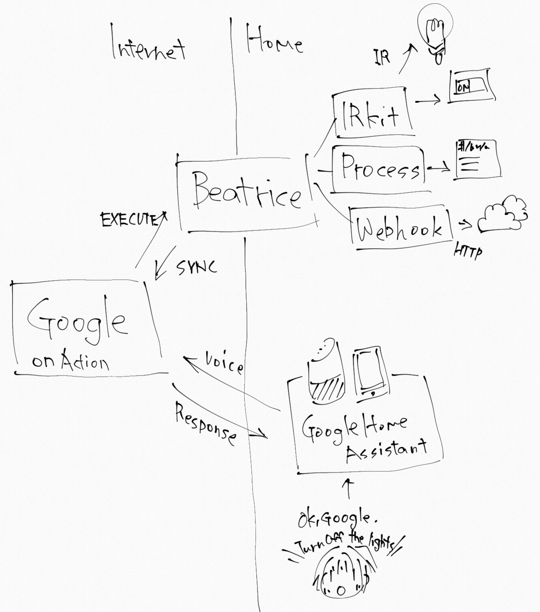

# Beatrice
Smart home service for personal use works with Google Assistant/Google Home.

Beatrice enables to control your home device or virtual devices (Process, WebHook, IRKit ...) via Google Assistant/Google Home. This relationship is also similar to [Homebridge](https://github.com/nfarina/homebridge) and HomeKit.


## What's the difference between IFTTT triggers and Beatrice?
IFTTT triggers can only accept a simple phrase (with number or text ingredient). So it means you must say the sentence correctly, and the trigger isn't a part of the home controls. For that reason, when you try telling "Turn off all lights", Google Assistant doesn't trigger it.

In contrast, Beatrice behaves like a home control provider. For example, Beatrice exposes start/stop a external process as virtual switch. It means Google Assistant recognizes Beatrice's virtual devices as home devices. When you say "Turn off all lights", Google Assistant turns off all lights that include other home controlled devices (e.g. Philips Hue) not only Beatrice's devices.

## How it works



```
[Device] <==> [WebHook, Process, IRKit] <==> [Beatrice (Your Home)] <==> [Google] <==> [Google Home/Assistant] <==> [User] 
```

## Note
**WARNING:** Beatrice is built for **personal use** purpose. You **SHOULD NOT** use for a non-personal purpose. There is no guarantee that this application will be available in the future.

And You **MUST** consider and configure carefully. If the configuration has some defect; your home may be compromised by malicious users.

## Prerequisites
- .NET Core 2.x supported Operating System (Windows, macOS, Linux)
  - Beatrice also works on Raspberry Pi 3 + Raspbian Lite✨
- Google account
- Google Assistant enabled device (e.g. Android Phone, Google Home, etc...)
- Connectivity from the Internet
  - You expose inbound port to the Internet or use a proxy (e.g. [ngrok](https://ngrok.com/), SSH port forwarding, [Azure AD Application Proxy](https://docs.microsoft.com/azure/active-directory/active-directory-application-proxy-get-started)...).

## How to use
- [Quick Start](QuickStart.md) ([日本語](QuickStart.ja.md))

## Components
- Device (Beatrice/Actions on Google)
  - Feature (Beatrice)
    - Trait (Actions on Google)
      - Command (Actions on Google)
    - Trait (Actions on Google)
      - Command (Actions on Google)
  - Feature
    - Trait
      - Command
    - Trait
      - Command

### Terminology

- 💡**Device**: represents a smart home device on Google Assistant. It has one or more "Feature" and provides device type(e.g. `action.devices.types.LIGHT`) which may be a virtual device on Beatrice.
- 📝**Feature**: "Feature" on Beatrice has one or more "Trait". For example, `action.devices.types.DRYER` device may provide `OnOff` and `Modes` traits. That can be "Feature" as `OnOffAndModeSupportedDryer` on Beatrice.
- 🔌**Trait**: describes a device has one or more function/attribute. For example, a room light has a `action.devices.traits.Brightness` Trait and `actions.devices.commands.OnOff` Command.
- ⚙**Command**: describes control of a device via "Actions on Google". `Trait` supports some commands. For example, a device has `action.devices.traits.OnOff` that can receive `action.devices.commands.OnOff`.

## Supported built-in Features
- **IrKitOnOff**: Call [IRKit](http://getirkit.com/) when switching On/Off.
- **WebHookOnOff**: Invoke WebHook when switching On/Off.
- **ProcessExecuteOnOff**: Execute external process when switching On/Off.

## How to configure/define virtual devices
Virtual devices on Beatrice are defined at **Beatrice:DeviceConfiguration:Devices** section in **appsettings.Beatrice.json**. You can add or remove your devices from there as you like.

```json
{
  "Beatrice": {
    "DeviceConfiguration": {
      "Devices": [
        ...
      ]
    }
  }
}
```

A format of device definition in **Devices** section is below.

```json
{
  "Type": "action.devices.types.OUTLET",
  "Id": "Excel:1",
  "Name": "Excel",
  "Nicknames": [ "エクセル" ],
  "Features": [
    {
      "Feature": "Beatrice.Device.Features.ExternalProcessOnOff",
      "Options": {
        "On": {
          "Executable": "C:\\Program Files\\Microsoft Office\\root\\Office16\\EXCEL.EXE",
          "Arguments": "",
          "WaitForExit": false
        },
        "Off": {
          "Executable": "taskkill",
          "Arguments": "/f /im excel.exe",
          "WaitForExit": false
        }
      }
    }
  ]
}
```

Each a device definition must have some properties.

- **Type**(string): [A device type of Actions on Google.](https://developers.google.com/actions/smarthome/guides/)
    - `action.devices.types.LIGHT`: The device behaves as a light.
    - `action.devices.types.OUTLET`: The device behaves as a outlet.
    - `action.devices.types.SWITCH`: The device behaves as a switch.
- **Id**(string): A device identifier(any string). It must be unique on all devices.
- **Name**(string): A device name. It is displayed on/recognized by Google Assistant and must be unique on all devices.
- **Features**(Features[]): List of features of a device. The device has one or more Beatrice's features.
  - Feature has one or more Trait and you should match implemented Traits by Type. [A device type has some recommended Traits](https://developers.google.com/actions/smarthome/guides/).

Some devices can have optional properties if needed.

- **Nicknames**(string[]): Aliases of a device. If the device has any nicknames, You call one of the nicknames, and Google Assistant can recognize it.

### Feature: Invoke a WebHook
`Beatrice.Device.Features.WebHookOnOff` Feature enables you can invoke WebHook when switching on/off via Google Assistant.

Say `"OK Google. Turn on 'NantokaKantoka'"` (`"OK Google, 'NantokaKantoka'をつけて"`) to Google Assistant or Google Home. Then Beatrice will invoke a WebHook on "http://www.example.com/on".

```json
{
  "Type": "action.devices.types.OUTLET",
  "Id": "Outlet:1",
  "Name": "NantokaKantoka",
  "Features": [
    {
      "Feature": "Beatrice.Device.Features.WebHookOnOff",
      "Options": {
        "On": {
          "Url": "http://www.example.com/on",
          "Body": "{ \"on\": true }"
        },
        "Off": {
          "Url": "http://www.example.com/off",
          "Body": "{ \"on\": false }"
        }
      }
    }
  ]
}
```

- **Options:On**: Invocation options when a device turns on.
- **Options:Off**: Invocation options when a device turns off.
  - **Url**: WebHook URL
  - **Body**: POST body
  - **ContentType**: `Content-Type` (optional. Default=`application/json`)


### Feature: Execute a process
`Beatrice.Device.Features.ExternalProcessOnOff` Feature enables you can execute an external process (e.g. shell script, exe, etc...) when switching on/off via Google Assistant.

Say `"OK Google. Turn on 'Excel'"` (`"OK Google, 'エクセル'をつけて"`) to Google Assistant or Google Home. Then Beatrice will launch Microsoft Excel.
And Say `"OK Google. Turn off 'Excel'"` (`"OK Google, 'エクセル'を消して"`), will kill Excel process.

```json
{
  "Type": "action.devices.types.OUTLET",
  "Id": "Excel:1",
  "Name": "Excel",
  "Nicknames": [ "エクセル" ],
  "Features": [
    {
      "Feature": "Beatrice.Device.Features.ExternalProcessOnOff",
      "Options": {
        "On": {
          "Executable": "C:\\Program Files\\Microsoft Office\\root\\Office16\\EXCEL.EXE",
          "Arguments": "",
          "WaitForExit": false
        },
        "Off": {
          "Executable": "taskkill",
          "Arguments": "/f /im excel.exe",
          "WaitForExit": false
        }
      }
    }
  ]
}
```

## TODO
- [ ] Web UI
- [ ] Implement Trait: Modes
- [ ] Support to provide device's status. (QUERY command)
- [ ] Reduce memory consumption. (-100MB)

## License
MIT License
